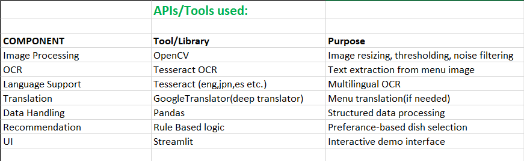

# Web-Project
# Problem Statement : Visual Menu Understanding & Dish Recommendation System
## System Architecture

The system follows a pipeline-based architecture for visual menu understanding and dish recommendation.

### Architecture Description

1. The user uploads a menu image through the Streamlit-based user interface.
2. The uploaded image is processed using Tesseract OCR to extract textual content.
3. Extracted text is parsed to identify dish names, descriptions, prices, and currency.
4. The system automatically detects the language of each dish name and translates it to English when required.
5. A curated dish knowledge base is used to enrich menu items with cuisine type, dietary classification, and other attributes.
6. A rule-based recommendation engine selects the most suitable dish based on user preferences.
7. The final structured output is displayed in the UI and exported as JSON.
### Tools and APIs used
.

### Demo video 
https://github.com/Sucharita023/Web-Projects/blob/main/VID-20260110-WA0001.mp4

